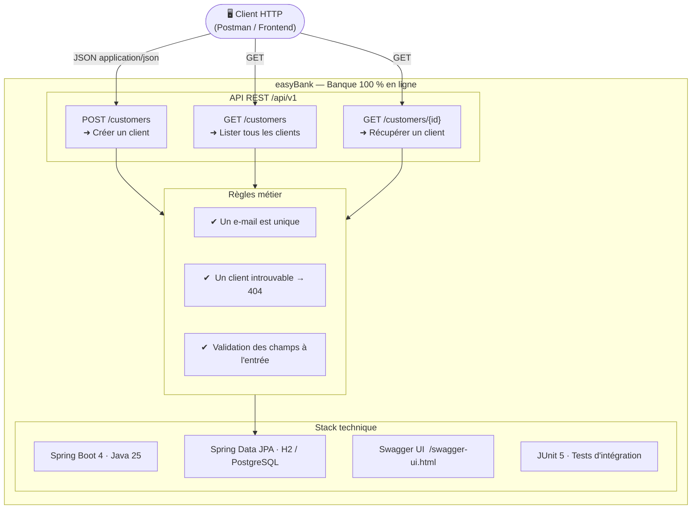
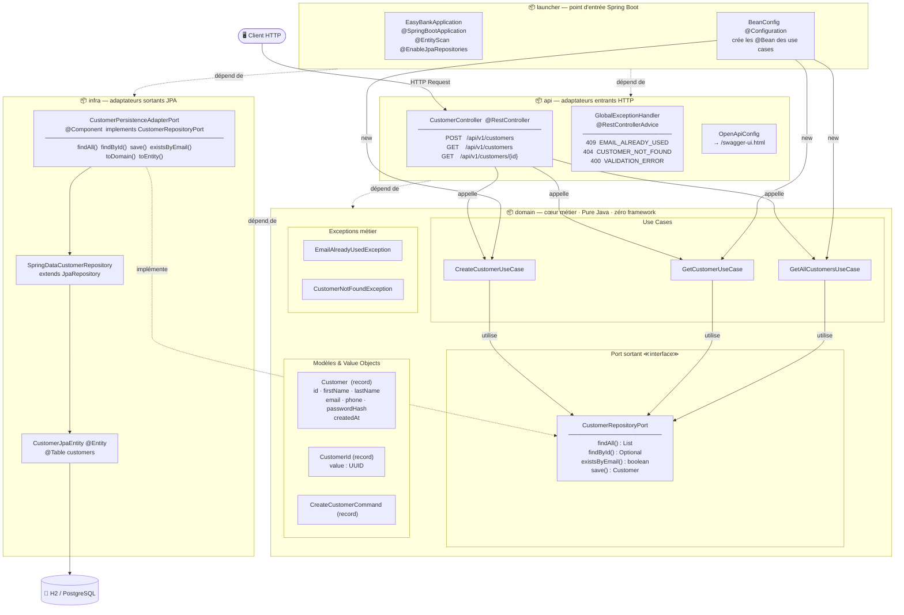
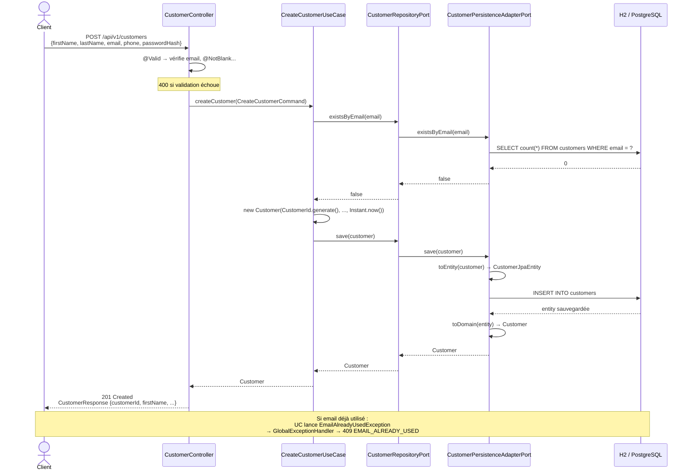
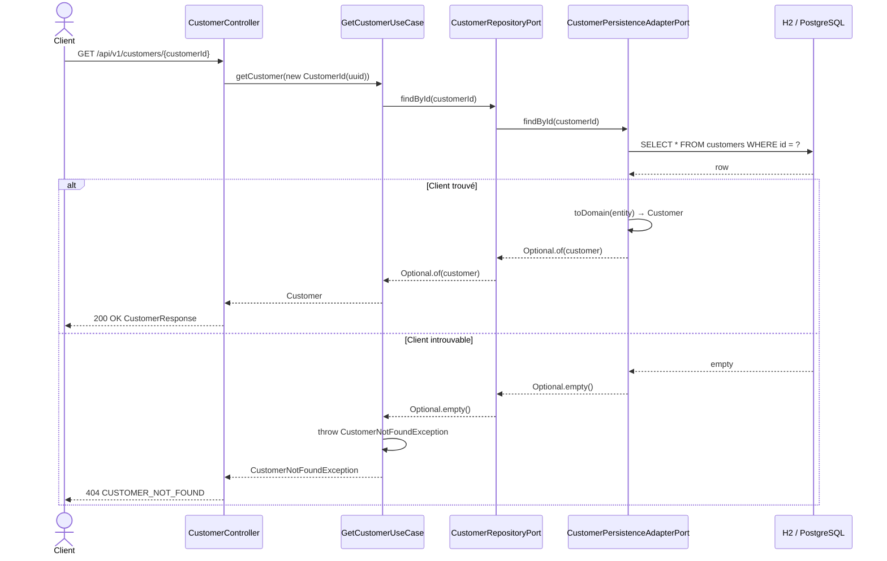
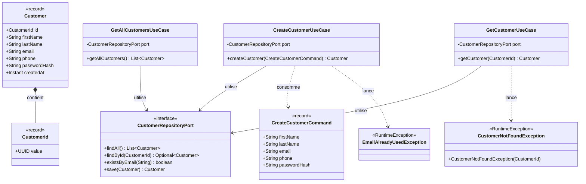

# easyBank — Diagrammes d'architecture

---

## 1. Présentation de l'application

---

## 2. Architecture hexagonale — modules et classes

> **Règle de dépendance** : les flèches pointent toujours **vers l'intérieur**.
> `INFRA` et `API` connaissent `DOMAIN` — jamais l'inverse.
> `api` et `infra` ne se connaissent **pas** entre eux.

---

## 3. Flux détaillé — Créer un client

---

## 4. Flux détaillé — Récupérer un client par ID

---

## 5. Modèle de domaine

